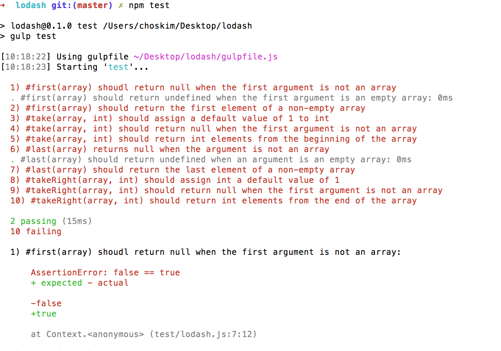

# lodash
[lodash][lodash] is [a popular utility library][popular-utility-library] written in JavaScript. Inside of it, you'll find a collection of methods, such as [forEach][for-each], which replaces the boilerplate code that developers often find themselves writing, such as code that iterates on every item of a collection. 

Here's an example:

```javascript
// Without lodash, you have to create your own implementation of forEach.
function forEach(arr, callback) {
  var i;

  for (i = 0; i < arr.length; i++) {
      callback(arr[i], i, arr);
  }

  return arr;
}

// "one" 0 ["one", "two", "three"]
// "two" 1 ["one", "two", "three"]
// "three" 2 ["one", "two", "three"]
// ["one", "two", "three"]
forEach(["one", "two", "three"], function(val, index, arr) {
  console.log(val, index, arr);
});


// With lodash, you're provided an implementation of forEach.
// "one" 0 ["one", "two", "three"]
// "two" 1 ["one", "two", "three"]
// "three" 2 ["one", "two", "three"]
// ["one", "two", "three"]
_.forEach(["one", "two", "three"], function(val, index, arr) {
  console.log(val, index, arr);
});
```

## Instructions
In this assignment, we want you to re-implement some of the most popular methods found in lodash. This task will provide you two incredible learning opportunities: first, you'll have the opportunity to apply your knowledge of JavaScript; second, you'll learn through this experience that lodash, similar to all JavaScript libraries, are written with the same JavaScript you've been learning!

Here are your instructions:

1. Fork this repository.
2. Open Terminal to the following path:
    `cd ~/Desktop`
3. Clone your fork to your local machine:
  `git clone lodash`
4. Change to the following path:
    `cd lodash`
4. Type the following command:
    `npm install`.
    (This command will download several npm packages used for this lab.)
5. After all packages have been downloaded, type the following command:
    `npm test`
6.  Notice the following output:
    
7. To make a failing test pass, open lodash.js and write an implementation of the method that corresponds to the failing test.
8. After you've created an implementation of the method, type this command:
    `npm test`
    (If your implementation is correct, the test you want to pass will change from failing to passing. This is a good moment to commit your work.)
8. Repeat steps 7 and 8 until all the tests are passing.
8. Push your commits to your forked repo on Github.
9. Copy the URL for your forked version of lodash and paste it into the LMS.

[lodash]: https://lodash.com
[popular-utility-library]: https://www.npmjs.com/package/lodash#installation
[for-each]: https://lodash.com/docs#forEach
